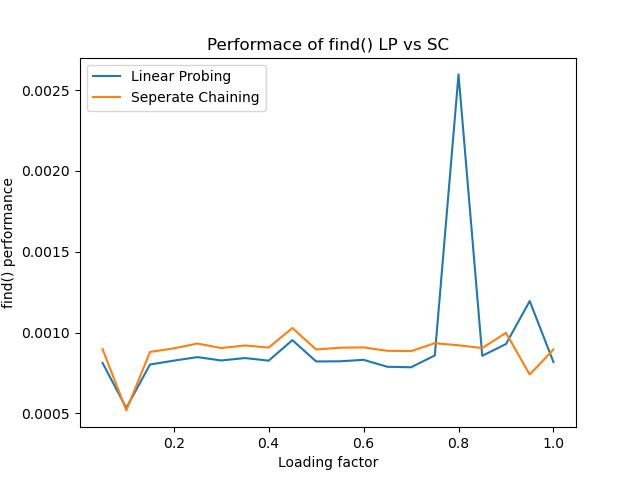
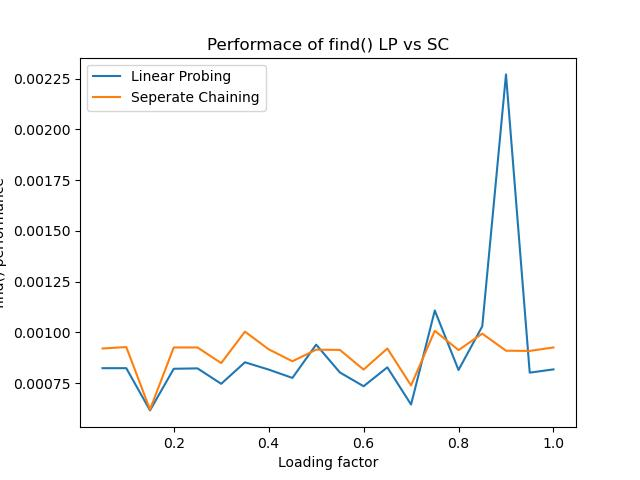
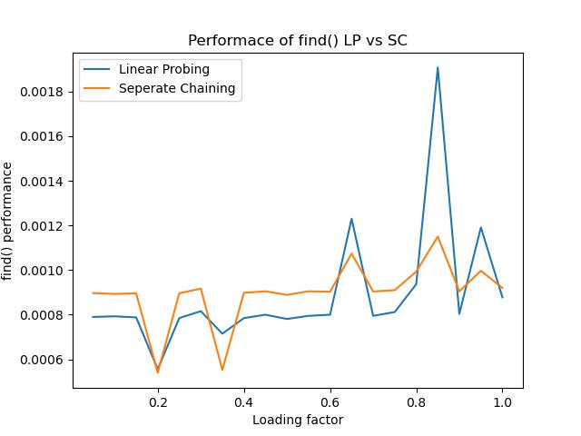
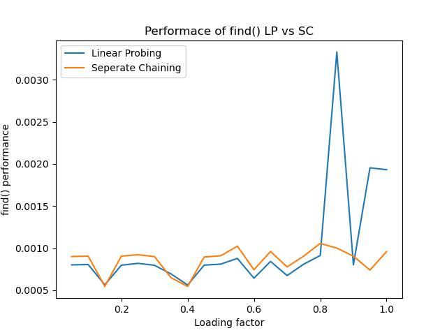
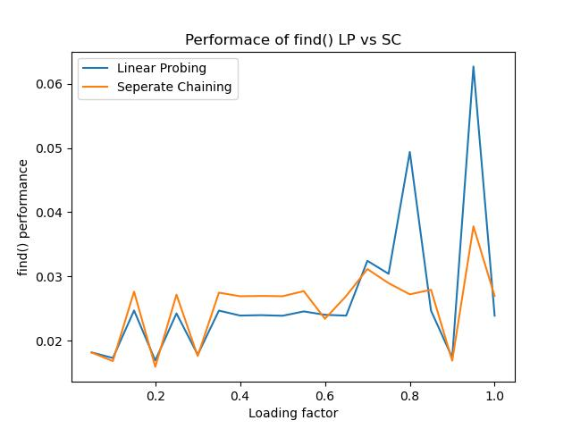

# Part A

Analyze the functions listed, below, state the final answer (in big-O notation) into the table. **A proper analysis is required below**.

## Summary table

| Function | run time with respect to number of records in table | 
|---|---|
| numRecords() |  O(n) |
| insert() - if item does not exist  | O(n^2)  |
| modify - if item does exist  | O(n^2)  |
| find() - if item is not there | O(n)  |
| remove() - if item is there | O(n^2)  |
| copy constructor | O(n^3)  |
| move constructor | O(1)  |
| move assignment operator  | O(n^3)  |
| destructor  | O(n^3)  |


## Analysis

**Let T(n) be the total number of operations, n be the caoacity(size) of the table(array).**

### numRecords()

```cpp
template <class TYPE> int SimpleTable<TYPE>::numRecords() const {
    int rc = 0;     //  2 
    for (int i = 0; records_[i] != nullptr; i++) {      //  6 * n
        rc++;       //  2 * n
    }
    return rc;      //  1 
}
```

T(n) = 2 + 6 * n + 2 * n + 1

T(n) = 8 * n + 3

**T(n) is of O(n)**

<hr>

### insert() - if item does not exist

``` cpp
void grow() {
    Record **newarray = new Record *[capacity_ * 2 + 1];    //  4
    int sz = numRecords();              //  2 + 8 * n + 3
    for (int i = 0; i < sz; i++) {      //  6 * n 
        newarray[i] = records_[i];      //  3
    }
    capacity_ *= 2;                     //  2
    delete[] records_;                  //  1
    records_ = newarray;                //  1
}

// Total number of operations of grow(): 16 + 14 * n

template <class TYPE>
bool SimpleTable<TYPE>::insert(const std::string &key, const TYPE &value) {
    int idx = -1;               //  2
    int sz = numRecords();      //  2 + 8 * n + 3
    bool rc = false;            //  2
    for (int i = 0; i < sz; i++) {          //  6 * n
        if (records_[i]->key_ == key) {     //  3 * n
            idx = i;                        //  1
        }
    }
    
    if (idx == -1) {            //  2
        if (sz == capacity_) {  //  2
            grow();             //  16 + 14 * n
        }
        records_[numRecords()] = new Record(key, value);    //  3 + 8 * n + 3

        // Total number of ops until this point: 36 + 39 * n

        for (int i = 0; i < sz - 1; i++) {                  //  worse case: 6 * (n - 1)
            for (int j = 0; j < sz - 1 - i; j++) {          //  Inner for loop:  (n - 1) * (n - 1 - i) * 6
                if (records_[j + 1]->key_ < records_[j]->key_) {    //  (n - 1) * (n - 1 - i) * 8
                    Record *tmp = records_[j];              //  (n - 1) * (n - 1 - i) * 3
                    records_[j] = records_[j + 1];          //  (n - 1) * (n - 1 - i) * 4
                    records_[j + 1] = tmp;                  //  (n - 1) * (n - 1 - i) * 3
                }
            }
        }
        rc = true;          //  1
    }

    return rc;              //  1
}
```

The total number of operation of the inner for loop: 

let a = (n-1) * (n - 1 - i)

a * (6 + 8 + 3 + 4 + 3)  = 24 * a 


$$ \sum_{i=0}^{n-1} (n-1) * (n - 1 - i) $$

Therefore, total number of operations:

$$ T(n) = 36 + 39 * n + 6 * (n - 1) + 1 + 1 + \sum_{i=0}^{n-1} (n-1) * (n - 1 - i) $$

$$ T(n) = 30 + 45 * n + \sum_{i=0}^{n-1} (n-1) * (n - 1 - i) $$

If we expand the equation, we could see that the highest term is n squared. Therefore, T(n) is of order:

$$O(n^2)$$ 

<hr>

### modify - if item does exist

```cpp
template <class TYPE>
bool SimpleTable<TYPE>::modify(const std::string &key, const TYPE &value) {
    int idx = -1;       //  2
    bool rc = false;    //  2
    for (int i = 0; i < numRecords(); i++) {    //  (6 + 8 * n + 3 ) * n
        if (records_[i]->key_ == key) {         //  3 * n   
            idx = i;                            //  1
        }
    }
    if (idx != -1) {                            //  2      
        records_[idx]->data_ = value;           //  3
    }
    return rc;                                  //  1
}
```

T(n) = 2 + 2 + (6 + 8 * n + 3) * n + 3 * n + 1 + 2 + 3 + 1

T(n) = 11 + (9 + 8 * n) * n + 3 * n

$$T(n) = 8n^2 + 12 n + 11$$

T(n) is of $$O(n^2)$$

<hr>

### find() - if item is not there

```cpp
template <class TYPE>
bool SimpleTable<TYPE>::find(const std::string &key, TYPE &value) {
    int idx = -1;                           //  2
    int size = numRecords();                //  2 + 8 * n + 3
    for (int i = 0; i < size; i++) {        //  6 * n
        if (records_[i]->key_ == key) {     //  3 * n
            idx = i;                        //  1
        }
    }
    if (idx == -1) {                        //  2
        return false;                       //  1     
    } else {                                //  1
        value = records_[idx]->data_;       //  3
        return true;                        //  1
    }
}

```

T(n) = 2 + 2 + 8 * n + 3 + 6 * n + 3 * n + 1 + 2 + 1 + 1 + 3 + 1

T(n) = 16 + 17 * n

Therefore, T(n) is of order **O(n)**

<hr>

### remove() - if item is there

```cpp
template <class TYPE> bool SimpleTable<TYPE>::remove(const std::string &key) {
    int idx = -1;                               //  2
    for (int i = 0; i < numRecords(); i++) {    //  (6 + 8 * n + 3 ) * n
        if (records_[i]->key_ == key) {         //  3 * n   
            idx = i;                            //  1
        }
    }
    if (idx != -1) {                            //  2
        delete records_[idx];                   //  2
        for (int i = idx; i < numRecords() - 1; i++) {  //  (6 + 8 * n + 3 ) * n
            records_[i] = records_[i + 1];              //  3
        }
        records_[numRecords() - 1] = nullptr;           //  2 + 8 * n + 3
        return true;                                    //  1
    } else {                                    //  1
        return false;                           //  1
    }
}
```
T(n) = 2 + (6 + 8 * n + 3) * n + 3 * n + 1 + 2 + 2 + (6 + 8 * n + 3) * n + 3 + 2 + 8 * n + 3 + 1 + 1 + 1

Simplify the equation we get:

$$ T(n) = 16n^2+29n+18 $$

Therefore, T(n) is of order $$O(n^2)$$

<hr>

### copy constructor

```cpp
template <class TYPE>
SimpleTable<TYPE>::SimpleTable(const SimpleTable<TYPE> &rhs) {
    records_ = new Record *[rhs.capacity_ + 1];     //  3
    capacity_ = rhs.capacity_;                      //  2
    for (int i = 0; i < capacity_ + 1; i++) {       //  6 * n
        records_[i] = nullptr;                      //  2 * n
    }
    for (int i = 0; i < rhs.numRecords(); i++) {                //  (6 + 8 * n + 3 ) * n  
        insert(rhs.records_[i]->key_, rhs.records_[i]->data_);  //  (2 + n^2) * n 
    }
}
```

$$ T(n) = 3 + 2 + 6 * n + 2 * n + (6 + 8 * n + 3 ) * n + (2 + n^2) * n  $$ 

Simplify equation, we have:

$$ T(n) = n^3+8n^2+19n+5 $$

Therefore, T(n) is of order $$ O(n^3) $$

<hr>

### move constructor

```cpp
template <class TYPE> SimpleTable<TYPE>::SimpleTable(SimpleTable<TYPE> &&rhs) {
    capacity_ = rhs.capacity_;      //  1
    records_ = rhs.records_;        //  1   
    rhs.records_ = nullptr;         //  1
    rhs.capacity_ = 0;              //  1
}
```

T(n) = 4, T(n) is of order **O(1)** 

<hr>

### move assignment operator

```cpp
template <class TYPE>
const SimpleTable<TYPE> &SimpleTable<TYPE>::operator=(SimpleTable<TYPE> &&rhs) {
    if (records_) {                         //  1
        while (numRecords() != 0) {         //  (8 * n + 3 ) * n  
            remove(records_[0]->key_);      //  (16 * n^2 + 29 * n + 18 + 1) * n    
        }
        delete[] records_;              //  1
    }
    records_ = rhs.records_;            //  1
    capacity_ = rhs.capacity_;          //  1
    rhs.records_ = nullptr;             //  1
    rhs.capacity_ = 0;                  //  1

    return *this;                       //  1
}
```

$$ T(n) = (8 * n + 3 ) * n + (16 * n^2 + 29 * n + 18 + 1) * n + 7 $$

Simplify equation, we have:

$$ T(n) = 16n^3+37n^2+22n+7 $$

Therefore, T(n) is of order $$ O(n^3) $$

<hr>

### destructor
```cpp
template <class TYPE> SimpleTable<TYPE>::~SimpleTable() {
    if (records_) {                         //  1
        int sz = numRecords();              //  2 + 8 * n + 3
        for (int i = 0; i < sz; i++) {      //  6 * n
            remove(records_[0]->key_);      //  (16 * n^2 + 29 * n + 18 + 1) * n   
        }
        delete[] records_;                  //  1
    }
}
```

$$ T(n) = 1 + 2 + 8 * n + 3 + 6 * n + (16 * n^2 + 29 * n + 18 + 1) * n + 1 $$

Simplify equation, we have:

$$ T(n) = 16n^3+29n^2+33n+7 $$

Therefore, T(n) is of order $$ O(n^3) $$

# Part B

* Suggestion 1:
    
    Change: numRecords()

    I would create a class variable numRecords_ to store the number of records. Every time a record is added to the table, the numRecord_ will be incremented by 1. Similarly, its value will be decremented by 1 is a record is removed from the table.

    So, the numRecords() does not have to traverse the list everytime the function is called. Instead, it will just return the variable numRecord_.

* Suggestion 2:

    Change: insert()

    In the insert() function, every time a record is inserted, the array will be re-sorted. The sorting algorithm in this function has a time complexity of O(n^2). However, this can be improved significantly given the table is always sorted by key.

    We could implement a binary search to find a proper index for the new key. Binary search has a time complexity of O(log n). After finding the right position for the new key, we need to shift the elements after the position of thie new key. In worst case, this will cost O(n). Therefore, the time complexity of binary search followed by an insertion is O(n log n)

* Suggestion 3: 

    Change:  copy constructor, move assignment operator and  destructor

    The above methods call remove() and/or insert().

    remove() and insert() do additional things do keep the table sorted after deletion and insertion.
    However, in the destructor and move assignment, we only care about deleting the records properly, we do not care if the table will remain sorted after every single deletion. Therefore, we could just use `delete table_[index]` instead.
    
    Similarly, in the copy constructor, the elements in the other table is already sorted, therefore, all we care about is copying the data over properly since the elements are already in the right places. So, we could just simply allocate a new Record copy the key and value over.

# Part D

## Experiment Description

In order to perform this experiment, the max loading factor of the LP table was modified to 1.0.

The design of the experiment is as followed:

The capacity of the tables is fixed to 150000.

Loading factors of 0.05 to 1 were tested with an inteval of 0.05.

For each loading factor, the tables will be loaded with a certain number of records which equals to loading factor * capacity.

Then, a random key will be obtained from the keys list, which will be used to search the tables. There are certain probabilities that the key is not in the table.

For each loading factor, 10000 find() will be perform with random keys.

Such performance will be repeated 30 time and the time consumed will be summed up and lastly, the average will be taken as the result. 


## Graph(s)



**Here are few more sample runs with a process priority of -20**







**Average find() time**




**Summation find() time**

(Taking the sum instead of the average of the 30 repetitions)

## Results

The graph does not perfectly reflect the result. Many graphs were generated with different result sets. They all tend to show one thing: **When loading factor is less than 0.7, LP table outperforms SC table. When the loading factor is greater than 0.7 and getting close to 1, SC table outperforms LP table.**

To answer the questions:

1. How fast is find() function at the same load factor?

    find() is able to locate the element rapidly, almost instant.

    At the same loading factor, and when the loading factor is less than about 0.7, LP table tend to find keys faster than SC table.

    When the loading factor is greater than 0.7, LP tables tend to find keys slower than SC table.


2. Does the load factor determine which table performs better?

    Yes. Please find explanation in the answer of question 1. And as the load factor gets bigger, the find() performs worse. But when it's less than a certain threshold, the performance doesnot change significantly.
