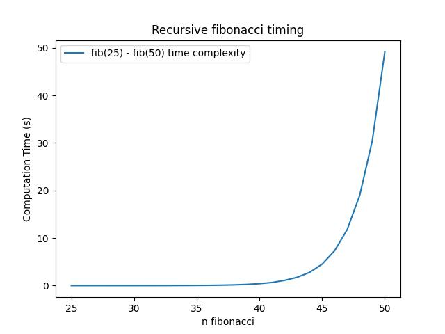

# Part 2: Analysis and Reflection

## power()

Let **_n_** represent the **power**.

Let **_T(n)_** represent number of operations needed to find **_power of n_** using the code.

```cpp
unsigned long long power (unsigned int base, unsigned int n){
    if (n == 0) return 1;               //  3  
    return base * power(base, n-1);     //  4 + number of operations done by power(base,n-1)
                                        //  4 + T(n-1)
}
```

When n is 0, only 3 operations are executed, in another word:

 `T(0) = 3`

When n is greater than 1, 2 + 4 + T(n-1) operations are executed: 2 from the if statements and 4 + T(n-1) from the return statement. Therefore:

`T(n) = 6 + T(n-1)`

Similarly, we have:

```
T(n-1) = 6 + T(n-2)

T(n-2) = 6 + T(n-3)

T(n-3) = 6 + T(n-4)

...

T(0) = 3
```

In total, we have **(n-1)6's** when n reaches 1. For n = 0, there are a total of 3 operations.

Thus, `T(n) = 6(n-1) + 3 = 6n - 3.`

Therefore, ***T(n)*** is ***O(n)***

<br />

## factorial()

```cpp
unsigned long long factorial (unsigned int n){
    if (n == 0) return 1;           //  3
    return n * factorial(n-1);      //  4 + number of operations done by factorial(n-1)
                                    //  4 + T(n-1)
}
```

Very similar to the analysis of power(), when n is 0, only 3 operations are executed:

`T(0) = 3`

When n is greater than 0:

`T(n) = 6 + T(n-1)`

2 operations from the if statement and 4 + T(n-1) from the return statement.

Thus, there are a total ***(n-1)6's*** when n reaches 1 and 3 operation when n is 0. So,

`T(n) = 6(n-1) + 3 = 6n - 3`

Therefore, ***T(n) is O(n)***.

<br />

## Questions regarding fibonacci()

1. Did you find it easier to write the recursive fibonacii() function or the iterative version?

    `
    I find it easier to write it in the recursive way. The recursive code is self-explanatory mean while the iterative way is a bit complex because there are 2 base cases and I have to keep track of the current value and the previous value.
    `

2. Without performing a full analysis
    - there is no right or wrong to this question ... just give it your honest best guess. Its a hypothesis... don't google for the answer. This is a hypothesis. You do this then see if your observations support what you think. Its ok to be wrong.
    - what do you think the runtime of your recursive fibonacci function is (stated with big-O notation)?

    `
    I did not google the answer for this question but I know that the cost of the recursive fibonacci is exponential, O(2^n) and the iterative approach is O(n).
    `

    - Explain why you think this.

    `
    I think this is like a tree. 
    In the recursive way, fib(n) makes 2 calls, fib(n-1) and fib(n-2). These 2 new function calls make 2 calls each, a total of 4 calls. And these new function calls makes 2 calls each, a total of 8 calls... It's not hard to see that fib(n) is like the root of the tree, and it has 2 branches, fib(n-1) and fib(n-2). Each child nodes has 2 branches respectively and their children also has 2 branches respectively. The tree keeps expanding in this way until it reaches the leaf node (when n is 0, 1 or 2).
    `

    `
    For fib(n), there are n tiers and each child node has 2 branches, except for the leaf node and the ones that branch to leaf node. 
    `

    ```
    Tier 0: 1 node
 
    Tier 1: 2 nodes
 
    Tier 2: 4 nodes
 
    Tier 3: 8 nodes
 
    ...
 
    Tier n: 2^n nodes
    ```
    `
    Therefore, if we do the math, we know that the tree has approximately 2^n nodes.
    `

    `
    Therefore, to find out fib(n), we have to exhausively traverse the whole tree since computed results are not stored. 
    `

    `
    Thus, the cost of recursive finbonacii() function is exponential time, O(2^n).
    `

3. Modify the file lab2timing.cpp to get a timing of running the fibonacci function. Record the time needed to run fib for n ranging from 21 to 45 inclusive (timing results for values smaller than 21 are pretty small but feel free to run and include them if you want). Feel free to modify lab2timing.cpp however you want to get the data you need.

    ```
        n         time(s)
        ---------------------
        25        0.00054
        26        0.00087
        27        0.00144
        28        0.00228
        29        0.00339
        30        0.00527
        31        0.00773
        32        0.01121
        33        0.01611
        34        0.02350
        35        0.03717
        36        0.05968
        37        0.09557
        38        0.15360
        39        0.24803
        40        0.40284
        41        0.64983
        42        1.09262
        43        1.73117
        44        2.77333
        45        4.50775
        46        7.33810
        47        11.77649
        48        18.98832
        49        30.44493
        50        49.17039
    ```
    
    `
        n is the fibonacci number to be computed and time is the time that the computation took in second. Timing results under 25 are still small so I used range 25 to 50 instead.
    `
            
    `
        A timing test was also ran with the iterative approach. And it only took less than a blink to compute fibonacci number from 25 to 50.
    `


4. Take the data you generated and create a line graph using a spreadsheet program such as google spreadsheet or excel. The line graph should be organized as follows:
    - x axis represents n
    - y axis represents time
    - provide clear labeling and titles
    - place the image of the graph into your lab2.md file as part of your answer. The easiest way to do this is to plot the graph using google spreadsheet and then use the built in sharing function and embedding functionality to create a link to the image for your lab2.md. However, there are other ways and you are free to use whatever method you want as long as there is an image of the graph in your lab2.md.

        

5. Given the timing, and your original guess, does the run time fit your original hypothesis?

    `
    Yes. From the graph we can see that the turning point is when n = 46, the computation time starts to grow exponentially.
    `
