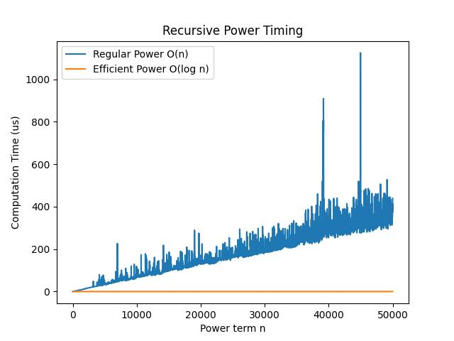

# Lab 2 Challenge

The straight forward way to look at the power() function is to calculate base^n as base * base^(n-1).  Doing so would lead to an analysis that is similar to that of the factorial() function and lead to a runtime of O(n).

The challenge is to find a solution that is better than O(n).  Write the function and do an analysis to show that your solution is better than O(n).

## Answer:

```cpp
//  Regular power: O(n)
unsigned long long power (unsigned int base, unsigned int n){
    return (n==0) ? 1 : base * power(base, n-1);
}

// Efficient power: O(log n)
unsigned long long efficient_power (unsigned int base, unsigned int n){
    if (n == 0) return 1;   
    if (n % 2) return base * efficient_power(base, n - 1); 
    unsigned long long res = efficient_power(base, n/2);
    return  res * res;
}
```

A experiment was run to compute 6 to the power of 1 to 50,000.

The performance of the above functions are as followed:

```
Regular power took 8324.79 ms.
Efficient power took 5.00312 ms.
```

A graph is also plotted with for the computation time of 6 to the power of 1 to 50,000 with an interval of 10.



## Analysis:

Let **_n_** represent the **power**.

Let **_T(n)_** represent number of operations needed to find **_power of n_** using the code.

```cpp
// Efficient power: O(log n)
unsigned long long efficient_power (unsigned int base, unsigned int n){
    if (n == 0) return 1;   // 3 ops, base case
    if (n % 2) return base * efficient_power(base, n - 1);  // 4 + T(n-1) ops, only executed when power is odd.
    unsigned long long res = efficient_power(base, n/2);    // 2 + T(n/2)
    return  res * res;  //  2
}
```

Assume that power term n is **even**:

First we have: `T(n) = 2 + T(n/2) + 2` . Next:
```

T(n/2) = 2 + T(n/4) + 2

T(n/4) = 2 + T(n/8) + 2

T(n/8) = 2 + T(n/16) + 2

...

T(2) = 2 + T(1) + 2

T(1) = 4 + T(0)

T(0) = 3
```

From the pattern we can see the number of (2 + 2)s is: $$log_2n$$

So, T(n) can be expressed as:

$$T(n) = 4\cdot log_2 n + 3 + 4 = 4\cdot log_2 n + 7$$

If the power is odd, we will only have to pemfore additional 4 operations:

$$T(n) =  4\cdot log_2 n + 11$$

Thus, ***T(n) is O(log n)***.